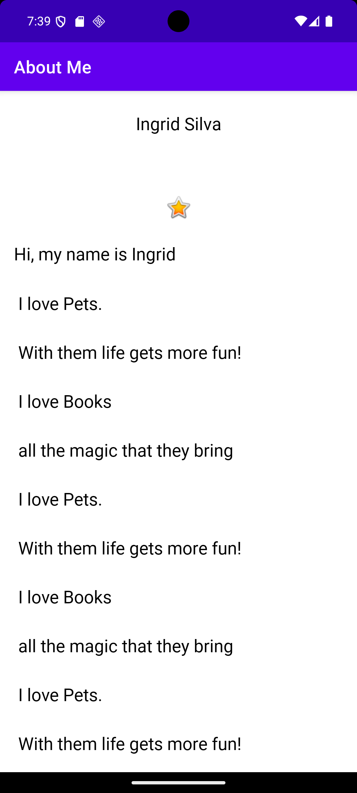

# 👤 About Me 

Este é o repositório do **Codelab Oficial do Google** para criar um app simples de “About Me” usando **Jetpack Compose**: a biblioteca declarativa de UI para Android.


## 📸 Demonstração

> Exemplo visual do app:



---

## 📌 Descrição

O app **About Me** é um projeto de introdução ao **Jetpack Compose**, onde você aprende a:

✔️ Usar componentes básicos do Compose  
✔️ Lidar com estados mutáveis  
✔️ Construir layouts flexíveis  
✔️ Atualizar UI em resposta a eventos do usuário

É um ótimo projeto inicial antes de avançar para apps mais complexos com Compose.

---

## 🛠 Pré-requisitos

Antes de rodar o projeto localmente, você precisa ter:

✔️ **Android Studio Flamingo / Electric Eel ou versão superior**  
✔️ **SDK Android atualizado**  
✔️ **Kotlin Plugin habilitado**  
✔️ **JDK 11+ compatível com o Android Studio**  
✔️ **Emulador Android configurado ou dispositivo físico com depuração**

> O Jetpack Compose é atualizado com frequência — manter suas ferramentas atualizadas garante que o projeto sempre compile.

---

## 🚀 Como Rodar o Projeto

### 1. Clone o repositório

Abra um terminal e execute:

```bash
git clone https://github.com/sinngjpeg/google-codelab-aboutme.git
cd google-codelab-aboutme
```

2. Abra no Android Studio

1. Inicie o Android Studio.
2. Escolha Open an existing project.
3. Selecione a pasta do projeto que você clonou.

O Android Studio irá detectar o Gradle e baixar automaticamente todas as dependências.

### 3. Sincronize o Gradle

Quando o projeto abrir:

- Aguarde o Gradle Sync finalizar
- Caso seja solicitado, aceite o download de componentes adicionais

Isso garante que o projeto compile mesmo que o tempo passe.

### 4. Configure o Dispositivo

Escolha onde quer rodar o app:

- ✔️ Emulador Android configurado pelo AVD
- ✔️ Dispositivo físico com depuração USB ativada

### 5. Execute o App

No Android Studio:

- Clique no botão Run ▶️
- Ou use o atalho Shift + F10

O app será construído, instalado e iniciado no dispositivo/emulador escolhido.

## 📁 Estrutura do Projeto
```bash
.
├── app/                      # Código principal do app
│   ├── src/main/java/…       # Código Kotlin
│   ├── src/main/res/…        # Layouts e recursos
│   └── build.gradle.kts      # Configurações do módulo app
├── build.gradle.kts          # Gradle de nível raiz
├── settings.gradle.kts
├── .gitignore
└── README.md
```

### 🧠 O Que Você Vai Aprender

- ✔️ Criar componentes com @Composable
- ✔️ Uso de remember para estados mutáveis
- ✔️ Composições simples de UI (Text, Button, Image)
- ✔️ Organizar elementos em layout com Column/Row

### 📚 Recursos Úteis

- 🔗 [Documentação oficial do Jetpack Compose](https://developer.android.com/jetpack/compose)

- 🔗 [Codelabs Android por Google](https://developer.android.com/codelabs)

